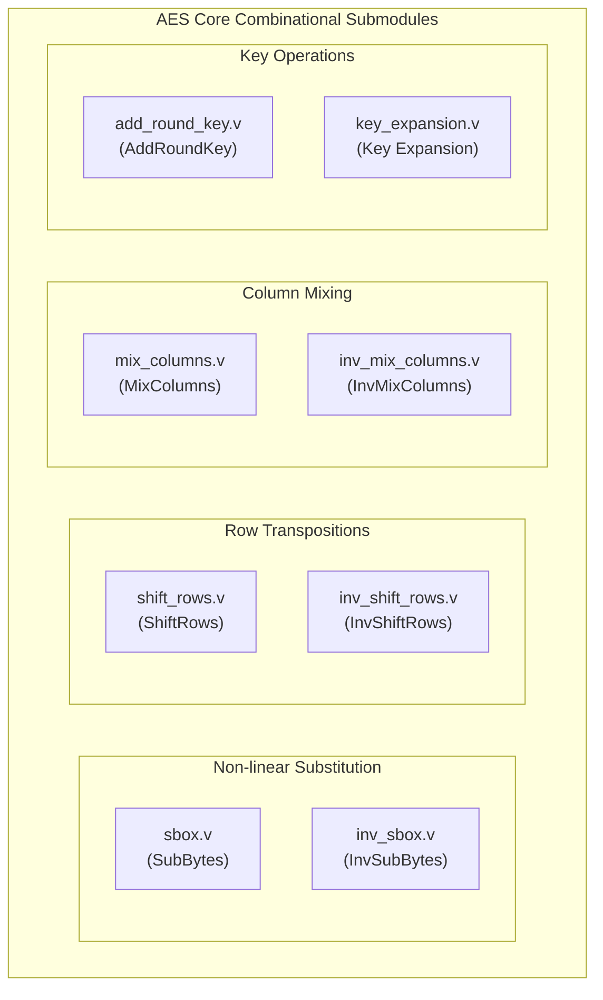

# AES-128 FPGA Hardware Architecture Diagrams

This document contains block diagrams visualizing the structure and data flow of the AES-128 cryptographic core and its corresponding hardware integration. The diagrams are generated using Mermaid.js.

## 1. AES-128 Encryption Block Diagram
This diagram outlines the standard AES-128 encryption algorithm. It uses a 128-bit key which is expanded into 11 round keys. The plaintext goes through an initial transformation, 9 main rounds, and 1 final round.

```mermaid
graph TD
    Plaintext[Plaintext (128-bit)] --> InitAR[AddRoundKey]
    Key[Cipher Key (128-bit)] --> KEx[Key Expansion]
    KEx -->|Round Key 0| InitAR
    
    InitAR --> R1[Round 1]
    
    subgraph "Main Rounds (1 to 9)"
    R1 --> Sub[SubBytes]
    Sub --> Shift[ShiftRows]
    Shift --> Mix[MixColumns]
    Mix --> AR[AddRoundKey]
    end
    
    KEx -->|Round Keys 1 to 9| AR
    AR --> R10[Round 10 (Final Round)]
    
    subgraph "Final Round (Round 10)"
    R10 --> SubF[SubBytes]
    SubF --> ShiftF[ShiftRows]
    ShiftF --> AR_F[AddRoundKey]
    end
    
    KEx -->|Round Key 10| AR_F
    AR_F --> Ciphertext[Ciphertext (128-bit)]
```

## 2. AES-128 Decryption Block Diagram
The decryption process applies the inverse transformations. The round keys are applied in the reverse order (from 10 down to 0). 

```mermaid
graph TD
    Ciphertext[Ciphertext (128-bit)] --> InitAR_D[AddRoundKey]
    Key[Cipher Key (128-bit)] --> KEx_D[Key Expansion]
    KEx_D -->|Round Key 10| InitAR_D
    
    InitAR_D --> R1_D[Round 1]
    
    subgraph "Main Inverse Rounds (1 to 9)"
    R1_D --> InvShift[InvShiftRows]
    InvShift --> InvSub[InvSubBytes]
    InvSub --> AR_D[AddRoundKey]
    AR_D --> InvMix[InvMixColumns]
    end
    
    KEx_D -->|Round Keys 9 down to 1| AR_D
    InvMix --> R10_D[Round 10 (Final Inverse Round)]
    
    subgraph "Final Inverse Round (Round 10)"
    R10_D --> InvShiftF[InvShiftRows]
    InvShiftF --> InvSubF[InvSubBytes]
    InvSubF --> AR_F_D[AddRoundKey]
    end
    
    KEx_D -->|Round Key 0| AR_F_D
    AR_F_D --> Plaintext[Plaintext (128-bit)]
```

## 3. AES Submodules Breakdown
A summary of the core transformation modules that make up the AES block operations. Each of these represents an isolated combinational logic module in the Verilog code.



## 4. Hardware Implementation & Control System
This diagram visualizes how the AES-128 core integrates within the full hardware structure (`uart_aes_top`), showing how the FSM coordinates the UART controllers and the AES hardware iteratively.

```mermaid
graph TD
    PC["External PC / USER"]
    
    subgraph "uart_aes_top (Top Level Integration)"
        direction TB
        
        UART_RX["uart_rx <br/>(Baud Rate Gen & Receiver)"]
        UART_TX["uart_tx <br/>(Baud Rate Gen & Transmitter)"]
        
        MainFSM["Top Level FSM <br/> (WAIT_RX → COMPUTE → SEND_TX)"]
        
        subgraph "aes_top"
            CU["control_unit <br/> (5-state Iterative FSM)"]
            KEX_HW["key_expansion <br/> (Combinatorial All-Keys)"]
            MUX["Round Key Multiplxer"]
            StateReg["128-bit State Register"]
            EncryptDP["aes_round <br/> (Combinatorial Datapath)"]
            DecryptDP["aes_inv_round <br/> (Combinatorial Datapath)"]
            
            CU -.->|controls| MUX
            CU -.->|enables| StateReg
            KEX_HW -->|rk0..rk10| MUX
            MUX --> EncryptDP
            MUX --> DecryptDP
            
            StateReg --> EncryptDP
            StateReg --> DecryptDP
            
            EncryptDP -->|encrypt_round_out| StateReg
            DecryptDP -->|decrypt_round_out| StateReg
        end
    end
    
    %% Communication paths
    PC -->|Serial RX (Hex)| UART_RX
    UART_RX -->|rx_data, rx_valid| MainFSM
    
    MainFSM -->|start, decrypt| CU
    MainFSM -->|plaintext, cipher_key| StateReg
    MainFSM -->|cipher_key| KEX_HW
    
    CU -->|done pulse| MainFSM
    StateReg -->|ciphertext done| MainFSM
    
    MainFSM -->|tx_start, byte| UART_TX
    UART_TX -->|Serial TX (Hex)| PC
```

### Hardware Dataflow Summary
1. **Reception (UART RX)**: The Top Level FSM waits for 64 hexadecimal characters (32 for the 128-bit key, 32 for the 128-bit plaintext or ciphertext) via the `uart_rx` module.
2. **Compute (AES)**: The Top Level FSM pulses `start` into the `aes_top` core. The iterational `control_unit` inside `aes_top` starts cycling from round 0 to 10. `key_expansion` instantly derives all 11 round keys, and the `Round Key MUX` selects the appropriate one per cycle. Depending on the `decrypt` mode switch, the 128-bit `State Register` captures output either from the `aes_round` or `aes_inv_round` combinational datapath.
3. **Transmission (UART TX)**: Once the `control_unit` finishes round 10, it pulses `done`. The Top Level FSM captures the final output and sequentially drives it out through the `uart_tx` module back to the user.
