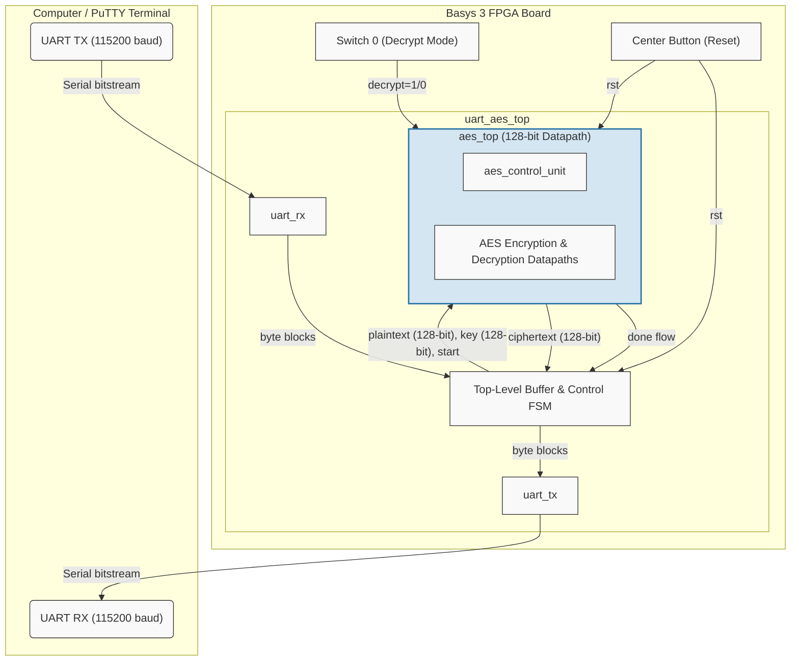
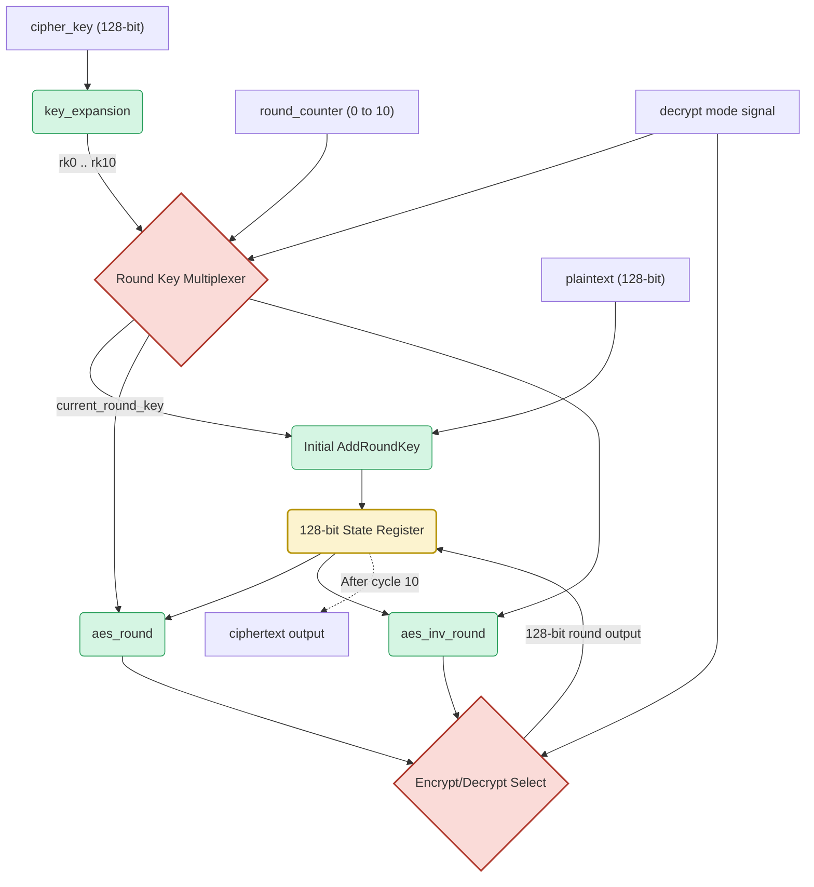
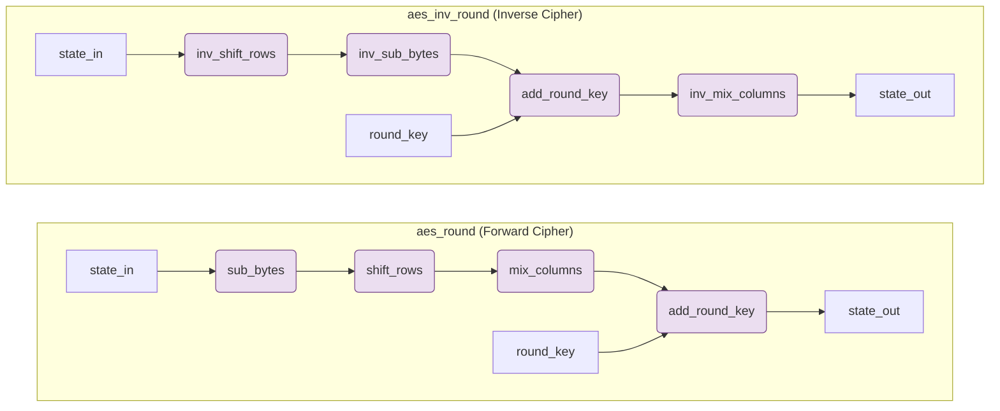

# AES-128 Hardware Architecture & Block Diagrams

The following diagrams illustrate the internal hardware architecture of the AES-128 core and how it interfaces with the physical Basys 3 board components via the UART wrapper.

## 1. System-Level Hardware Architecture (`uart_aes_top`)

This diagram shows how the computer communicates with the FPGA over USB-Serial, and how the top-level FSM buffers the 64 incoming characters, drives the AES core, and transmits the resulting ciphertext back.

---

## 2. AES Core Iterative Datapath (`aes_top`)

To save valuable logic gates (LUTs) on the FPGA, this AES core uses an **iterative architecture**. Instead of unrolling 10 physical rounds of logic, one single hardware round is instantiated and the data is fed back into a 128-bit state register repeatedly for 10 clock cycles.

---

## 3. Combinatorial Round Submodules

A single AES encryption/decryption round consists of four completely unclocked (combinatorial) mathematical transformations that execute continuously between clock edges.

### Note on Inverse Key Schedule
In the standard inverse cipher flow illustrated above, the key is dynamically indexed in reverse during operation (i.e. round 1 uses `rk[9]`, round 10 uses `rk[0]`). Because the `key_expansion` immediately calculates all 11 keys continuously in real-time, no extra clock cycles are wasted waiting for a backwards key expansion process.
